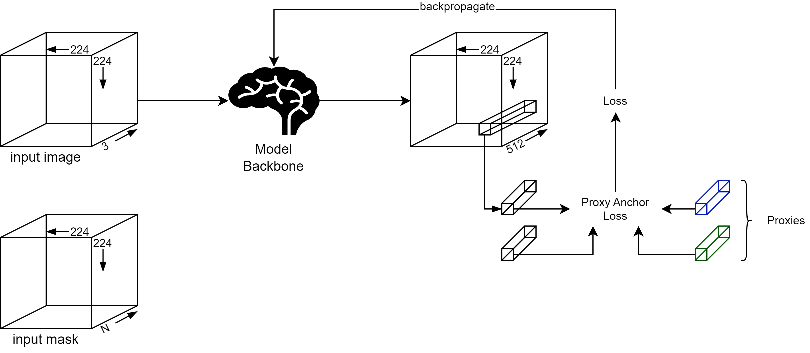
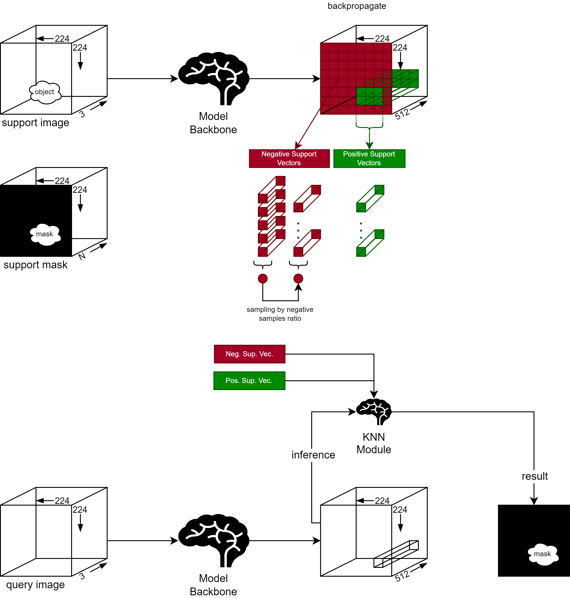

## Here will be updated later!

But for now, you can find the figures explaining how proxy optimization, training and inference works.

### Checkpoints
- [UNet++/ResNet101](https://drive.google.com/drive/folders/1COMCg4YN6Taw9SzO7FLgPdbP6aN8ZuMK?usp=sharing)

### Proxy Optimization

Here’s a step-by-step breakdown:

1. **Input Image**:
   - An input image of size \(224 \times 224 \times 3\) is provided.

2. **Model Backbone**:
   - The input image is passed through a model backbone, a neural network feature extractor that processes the image and produces an output feature map of size \(224 \times 224 \times 512\).

3. **Input Mask**:
   - An input mask of size \(224 \times 224 \times N\) is also provided, where \(N\) represents different regions or channels of interest in the image.

4. **Class Proxy Candidates**:
   - The feature map is used to generate proxy candidates for each class (e.g., Class 1, Class 2, Class 3). The diagram shows sampling from the feature maps to create these proxy candidates.
   - For each class, several proxy candidates are generated.

5. **Proxy Optimization**:
   - The proxy candidates for each class are summed up to generate a single proxy vector for each class.
   - This summation process combines the information from multiple candidates into a single, optimized proxy representation for each class.

6. **Final Proxy Vectors**:
   - The final proxy vectors for each class are shown in a vector space.
   - For example, a blue arrow represents the proxy for class 1, and a green arrow represents the proxy for class 2.
   - The diagram illustrates how these optimized proxy vectors are oriented in the vector space, indicating their final positions after optimization.

In summary, this process uses input images and masks to extract features, sample proxy candidates, and optimize these candidates to create robust proxy vectors representing different classes in a segmentation task.

### Training

### Inference

