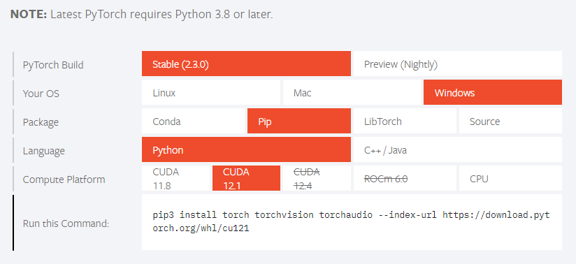

## Installation

``` Anaconda Prompt
conda create --name fss python==3.10
conda activate fss
pip install -r requirements.txt
```
If you had issue with PyTorch installation, 

or getting errors related to PyTorch when you are running the code,

go to https://pytorch.org/ choose your environment and get your installation command.



### Checkpoints
- [UNet++/ResNet101](https://drive.google.com/drive/folders/1COMCg4YN6Taw9SzO7FLgPdbP6aN8ZuMK?usp=sharing)

## Usage
### Configuration & Dataset

Adjust the config.json file according to your choice.
https://github.com/qubvel/segmentation_models.pytorch is used for the models. Therefore, you should refer to this repository to choose the encoding and decoding architectures.


**The datasets should be in this structure**:
- `data`
   - `dataset_name`
     - `train`
       - `image_name_1.jpg`
       - `image_name_1.json` # coco format
       - `image_name_2.jpg`
       - `image_name_2.json` # coco format
       - ...
     - `eval`
       - `image_name_3.jpg`
       - `image_name_3.json` # coco format
       - `image_name_4.jpg`
       - `image_name_4.json` # coco format


The dataset_name should be placed in config.json along with the nb_classes (number of classes in your dataset):
```config.json/data
data:
  folder_structure: "separate_json" # separate, separate_json, unified
  dataset: "dataset_name"
  input_size: 224
  nb_classes: 80
```

### Base model training
After you configure your folder structure and configuration file, run
```commandline
python train.py
```
### Finetuning
After the base model training is finished
you should adjust the data section in config.json
```config.json/data
data:
  folder_structure: "separate_json" # separate, separate_json, unified
  dataset: "finetuning_dataset_name"
  input_size: 224
  nb_classes: 1
```
then run
```commandline
python finetune.py
```

### Inference
If you want to run inference with raw model weights, you should use
```commandline
python inference.py --checkpoint_dir "some_dir" --support_image path1.jpg path2.jpg --support_annotation path1.json path2.json --inout_folder "output_folder"
```

### Model packaging
If you want to package your model with JIT Compiler, you should run
```commandline
python package_model.py --checkpoint_dir "some_dir" --device cuda
```

### Inference
If you want to run inference with packaged(jit compiled) model, you should use
```commandline
python packaged_inference.py --checkpoint_dir "some_dir" --support_image path1.jpg path2.jpg --support_annotation path1.json path2.json --inout_folder "output_folder"
```

## How it works

### Proxy Optimization


Here’s a step-by-step breakdown:

1. **Input Image**:
   - An input image of size (224x224x3) is provided.

2. **Model Backbone**:
   - The input image is passed through a model backbone, a neural network feature extractor that processes the image and produces an output feature map of size (224x224x512).

3. **Input Mask**:
   - An input mask of size (224x224xN) is also provided, where N represents different regions or channels of interest in the image.

4. **Class Proxy Candidates**:
   - The feature map is used to generate proxy candidates for each class (e.g., Class 1, Class 2, Class 3). The diagram shows sampling from the feature maps to create these proxy candidates.
   - For each class, several proxy candidates are generated.

5. **Proxy Optimization**:
   - The proxy candidates for each class are summed up to generate a single proxy vector for each class.
   - This summation process combines the information from multiple candidates into a single, optimized proxy representation for each class.

6. **Final Proxy Vectors**:
   - The final proxy vectors for each class are shown in a vector space.
   - For example, a blue arrow represents the proxy for class 1, and a green arrow represents the proxy for class 2.
   - The diagram illustrates how these optimized proxy vectors are oriented in the vector space, indicating their final positions after optimization.

In summary, this process uses input images and masks to extract features, sample proxy candidates, and optimize these candidates to create robust proxy vectors representing different classes in a segmentation task.

### Training


Here’s a step-by-step breakdown:

1. **Input Image**:
   - An input image of size (224x224x3) is provided.

2. **Model Backbone**:
   - The input image is passed through a model backbone, which is a neural network feature extractor that processes the image and produces an output feature map of size (224x224x512).

3. **Input Mask**:
   - An input mask of size (224x224xN) is also provided, where N represents different regions or channels of interest in the image.

4. **Proxies**:
   - The feature map is used to generate proxies, which are representative vectors for different classes (e.g., blue proxy for class 1 and green proxy for class 2).

5. **Proxy Anchor Loss**:
   - A proxy anchor loss is calculated based on the distance between the generated proxies and the corresponding feature vectors. This loss helps in adjusting the proxies to better represent their respective classes as well.

6. **Loss Calculation**:
   - The overall loss, which includes the proxy anchor loss, is calculated. This loss is then backpropagated through the model backbone.

7. **Backpropagation**:
   - The loss is used to update the model parameters through backpropagation. This process adjusts the model to minimize the loss and improve its performance on the task.

In summary, this process involves using input images and masks to extract features, calculate the proxy anchor loss, and backpropagate this loss to optimize the model and the proxies.


### Inference


This diagram represents a machine learning process involving support images, support masks, and query images to generate a result mask using a k-nearest neighbors (KNN) module. Here’s a step-by-step breakdown:

1. **Support Image**:
   - A support image of size (224x224x3) is provided, containing the object of interest.

2. **Support Mask**:
   - A corresponding support mask of size (224x224xN) is provided, highlighting the regions of interest within the support image.

3. **Model Backbone (Support)**:
   - The support image is passed through a model backbone, a neural network feature extractor, which produces an output feature map of size (224x224x512).

4. **Support Vectors**:
   - The feature map is divided into positive and negative support vectors:
     - **Positive Support Vectors** (green): Represent regions of interest.
     - **Negative Support Vectors** (red): Represent background region.
   - These vectors are sampled based on a negative_samples_ratio parameter.

5. **Query Image**:
   - A query image of size (224x224x3) is provided for which the corresponding mask needs to be predicted.

6. **Model Backbone (Query)**:
   - The query image is passed through the same model backbone to produce a feature map of size (224x224x512).

7. **KNN Module**:
   - The positive and negative support vectors are fed into a K-nearest neighbors (KNN) module along with the feature map of the query image.
   - The KNN module performs inference on query image vectors using the support vectors to predict the mask for the query image.

8. **Result Mask**:
   - The KNN module generates the result mask, highlighting the regions of interest in the query image.

In summary, this process uses support images and masks to extract feature vectors, which are then used by a KNN module to predict the mask for a query image, thereby identifying regions of interest.

